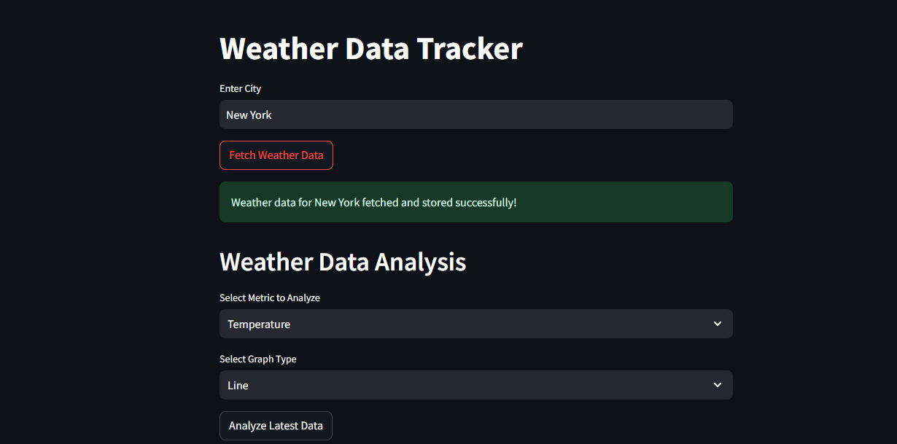
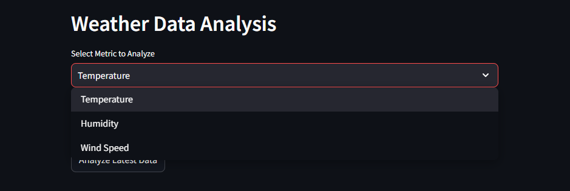
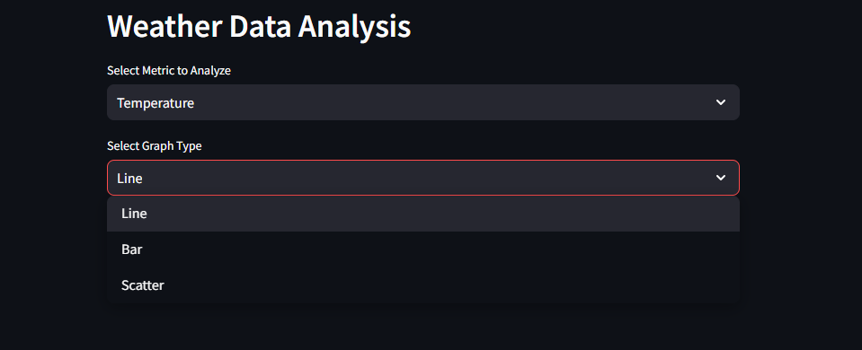
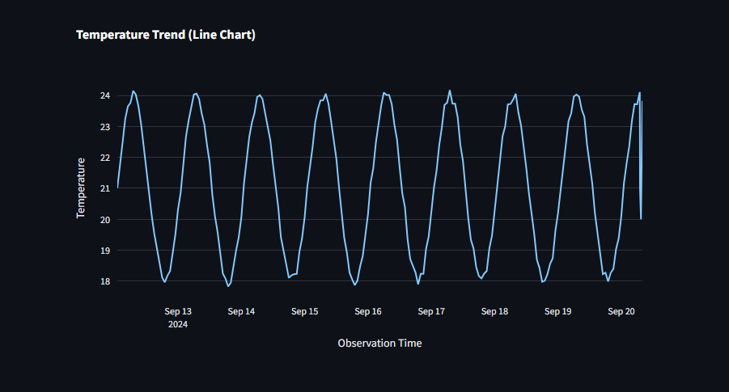

# Weather Data Tracker

The **Weather Data Tracker** is a Streamlit-based web application that fetches weather data for a specific city using the WeatherStack API and stores it in a local SQLite database. The app allows users to analyze weather data (temperature, humidity, and wind speed) over time and visualize it using various graph types.

## Features

- Fetch real-time weather data for any city using the WeatherStack API.
- Store and track weather data (temperature, humidity, wind speed, and observation time) in an SQLite database.
- Visualize weather data trends with interactive charts (line, bar, scatter) using Plotly.
- Analyze historical weather data for temperature, humidity, and wind speed.

## Requirements

- Python 3.7 or higher
- Streamlit
- Requests
- SQLite3
- Pandas
- Plotly

## Setup Instructions

### Step 1: Install Dependencies

Ensure you have Python 3.7+ installed.

You can install the required dependencies by running the following commands:

```bash
pip install streamlit requests pandas plotly
```

### Step 2: Set Up the WeatherStack API

1. Create a free account on [WeatherStack](https://weatherstack.com/).
2. Get your API key from the WeatherStack dashboard.
3. Replace the placeholder API key in the code:

   Open the `weather_tracker.py` file and replace the line:
   ```python
   api_key = "b69e40835bb2e01a5053fcd164322df9"  # Replace with your API key with your actual WeatherStack API key.

### Step 3: Run the Application

You can now start the Streamlit app by running:

```bash
streamlit run weather_tracker.py
```

This will launch the Streamlit application in your default web browser.

## Screenshot

<figure>
    
    <figcaption>Screenshot of Weather Data Tracker</figcaption>
</figure>

<figure>
    
    <figcaption>Select the parameter to be analyzed</figcaption>
</figure>

<figure>
    
    <figcaption>Select Graph Type</figcaption>
</figure>

<figure>
    
    <figcaption>Line plot of Temperature</figcaption>
</figure>


